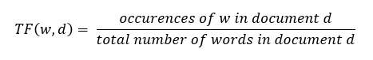
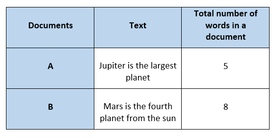
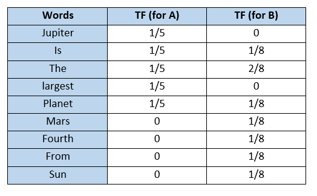
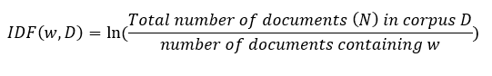
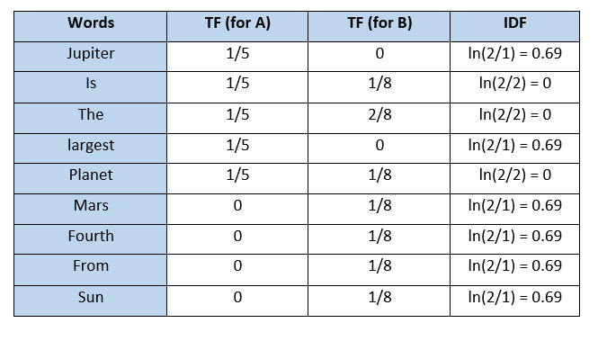

# Pertemuan 03 - Representasi Teks dalam Model Ruang Vektor (*Vektor Space Model*) menggunakan *Word Embedding*

## Apa itu VSM dan Word Embedding?
Dikutip dari [towardsdatascience.com](https://towardsdatascience.com/vector-space-models-48b42a15d86d/), VSM (Vector Space Model) adalah sebuah model yang umum digunakan untuk merepresentasikan teks sebagai sebuah vektor berupa angka. Karena tidak seperti manusia yang mampu memahami bahasa secara alami, komputer hanya bisa memahami angka. Dengan memanfaatkan VSM, komputer bisa mengenali apakah sebuah teks yang berbeda memiliki makna yang sama, maupun sebaliknya. Agar lebih jelas, perhatikan contoh berikut

Kedua kalimat di sebelah kiri memiliki 3 kata yang sama: "Where", "are", dan "you". Tetapi kata selanjutnya yang akan membuat makna keseluruhan kalimat berubah, menjadi "Dari mana kamu?" dan "Ke mana kamu pergi?"

Sedangkan pada 2 kalimat di sebelah kanan, seluruh kata pada kedua kalimat tidak ada yang sama. Tetapi makna keduanya sama, yang intinya menanyakan "Berapa umurmu?"

*Word Embedding* adalah istilah untuk metode-metode yang merepresentasikan kata atau kalimat dalam bentuk vektor. Terdapat beberapa metode yang akan kita bahas, yaitu Bag-of-Words, TF-IDF, dan N-Gram

## *Bag-of-Words* (BoW)

BoW adalah cara paling sederhana untuk merepresentasikan kata dalam bentuk numerik. Berikut adalah contoh 3 kalimat review sebuah film

- Review 1: This movie is very scary and long
- Review 2: This movie is not scary and is slow
- Review 3: This movie is spooky and good

Langkah-langkahnya adalah sebagai berikut:
1. Pertama-tama, seluruh kata dari semua kalimat dijadikan satu, secara tidak berulang, sehingga ada 11 kata yang terkumpul: 'This', 'movie', 'is', 'very', 'scary', 'and', 'long', 'not',  'slow', 'spooky',  'good'
2. Kata-kata tersebut lalu dimasukkan ke dalam tabel sebagai kolom, lalu kalimat review akan menjadi baris. Kemudian, untuk setiap kalimat yang ada kata tersebut di dalamnya, ditandai jumlahnya dengan 1, 2, dst.. Jika tidak, maka ditandai dengan 0, sehingga tabel akan terlihat sebagai berikut

Dari tabel di atas, didapat representasi vektor untuk setiap kalimat review sebagai berikut

- Vector Review1: [1 1 1 1 1 1 1 0 0 0 0]
- Vector Review2: [1 1 2 0 0 1 1 0 1 0 0]
- Vector Review3: [1 1 1 0 0 0 1 0 0 1 1]

Karena metode Bag-of-Words yang sangat sederhana, terdapat 3 kelemahan utama
1. Jika kita mendapat kalimat baru, contoh Review4, maka kolom dari tabel akan semakin banyak, dan vektor juga akan semakin panjang
2. Vektor di atas memiliki banyak angka 0 yang akan menjadi matriks rongga (*sparse matrix*). Hal ini akan memakan banyak memori komputer dan sebaiknya dihindari
3. Seluruh kata dianggap sama nilainya, padahal ada kata seperti 'is' yang akan sering muncul namun sebenarnya tidak begitu memberi banyak arti

Oleh karena itu, diperlukan metode lain yang bisa memperbaiki kekurangan di atas, yaitu TF-IDF, singkatan dari *Term Frequency-Inverse Document Frequency*. Kita akan memelajari satu-persatu dulu mulai dari TF, IDF, lalu penggabungan keduanya menjadi TF-IDF

## *Term Frequency* (TF)

Adalah perbandingan antara frekuensi suatu kata (`w`) dalam sebuah dokumen (`d`). Dokumen di sini adalah istilah umum, dapat diartikan sebagai kumpulan kata yang membentuk kalimat, paragraf, maupun teks secara utuh. Perbandingan antara jumlah kata `w` dan keseluruhan kata `d` adalah sebagai berikut

Agar lebih jelas, ikuti contoh berikut

Terdapat 2 dokumen berupa kalimat, A dan B, dengan total jumlah kata pada dokumen A adalah 5, dan B adalah 8. Menggunakan rumus di atas, kita membuat tabel untuk menghitung nilai TF dari setiap kata sebagai berikut

## *Inverse Document Frequency* (IDF)

Adalah metode untuk menghitung seberapa penting suatu kata dalam sebuah dokumen. Hal ini dapat menyelesaikan kekurangan dari BoW, yaitu kata-kata yang sering muncul seperti 'is', 'of', dan 'and', bisa sangat sering muncul namun sebenarnya tidak begitu penting dalam proses pengolahan teks lebih lanjut. Nilai IDF dapat dihitung menggunakan rumus berikut

Corpus (D) di sini adalah kumpulan dokumen (d). Pada contoh di atas, corpus berisi 2 dokumen. IDF untuk setiap kata adalah sebagai berikut

## *Term Frequency-Inverse Document Frequency* (TF-IDF)

