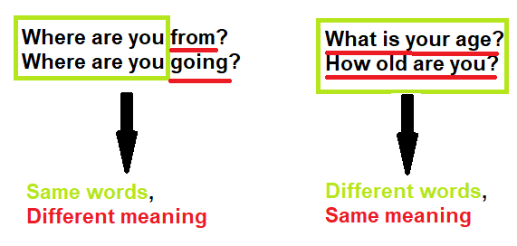
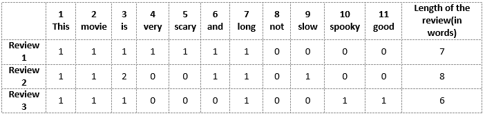

# Pertemuan 03 - Representasi Teks dalam VSM: TF-IDF, N-Gram, dan Word Embedding

## Apa itu VSM?
Dikutip dari [towardsdatascience.com](https://towardsdatascience.com/vector-space-models-48b42a15d86d/), VSM (Vector Space Model) adalah sebuah model yang umum digunakan untuk merepresentasikan teks sebagai sebuah vektor berupa angka. Karena tidak seperti manusia yang mampu memahami bahasa secara alami, komputer hanya bisa memahami angka. Dengan memanfaatkan VSM, komputer bisa mengenali apakah sebuah teks yang berbeda memiliki makna yang sama, maupun sebaliknya. Agar lebih jelas, perhatikan contoh berikut

Kedua kalimat di sebelah kiri memiliki 3 kata yang sama: "Where", "are", dan "you". Tetapi kata selanjutnya yang akan membuat makna keseluruhan kalimat berubah, menjadi "Dari mana kamu?" dan "Ke mana kamu pergi?"

Sedangkan pada 2 kalimat di sebelah kanan, seluruh kata pada kedua kalimat tidak ada yang sama. Tetapi makna keduanya sama, yang intinya menanyakan "Berapa umurmu?"

Ada berbagai cara untuk merepresentasikan kata atau kalimat dalam bentuk vektor, dan berikut adalah beberapa di antaranya

## Bag-of-Words (BoW)

BoW adalah cara paling sederhana untuk merepresentasikan kata dalam bentuk numerik. Berikut adalah contoh 3 kalimat review sebuah film

- Review 1: This movie is very scary and long
- Review 2: This movie is not scary and is slow
- Review 3: This movie is spooky and good

Langkah-langkahnya adalah sebagai berikut:
1. Pertama-tama, seluruh kata dari semua kalimat dijadikan satu, secara tidak berulang, sehingga ada 11 kata yang terkumpul: 'This', 'movie', 'is', 'very', 'scary', 'and', 'long', 'not',  'slow', 'spooky',  'good'
2. Kata-kata tersebut lalu dimasukkan ke dalam tabel sebagai kolom, lalu kalimat review akan menjadi baris. Kemudian, untuk setiap kalimat yang ada kata tersebut di dalamnya, ditandai dengan 1. Jika tidak, maka ditandai dengan 0

